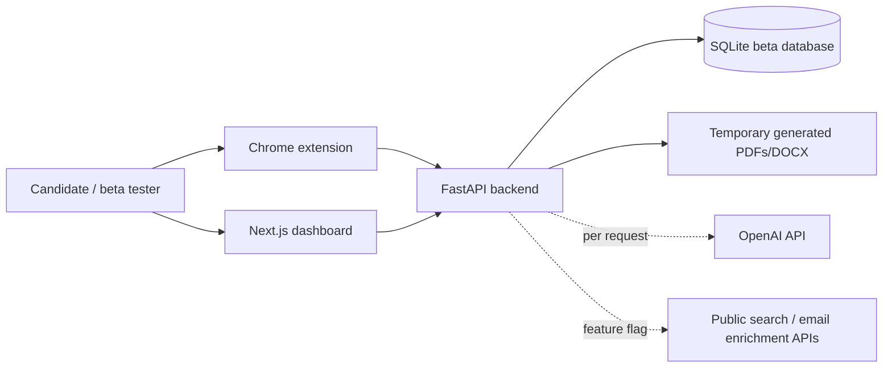

# JobApply Copilot

JobApply Copilot is an AI-assisted job application workflow system designed around a simple principle: help candidates move faster without hiding how the work is done or crossing platform boundaries. It combines a Chrome extension, a FastAPI backend, and a Next.js workspace to analyze job postings, tailor resumes and cover letters from factual profile data, draft outreach, and track application progress while keeping the final submission fully user-controlled.

This project stands out by treating compliance as a product feature rather than an afterthought. Instead of auto-submitting applications or bypassing guardrails, it keeps approval checkpoints, blocks unsupported claims, and uses local-first configuration so personal profile data and generated packets stay under the user's control.

## Why It Stands Out

- Multi-surface product design: a Chrome extension for in-page analysis, a FastAPI service for tailoring and export, and a Next.js app for public jobs discovery plus a private workflow dashboard.
- Ethical AI workflow: no CAPTCHA bypass, no hidden submission automation, and explicit user approval before final document generation or prefill actions.
- Portfolio-ready technical depth: structured parsing, compliance checks, document generation, referral target discovery, outreach drafting, and job-tracker flows in one end-to-end system.
- Local-first user data model: personal configuration, generated outputs, and local state stay on the user's machine by default.

## Highlights

- Chrome extension (Manifest V3) for in-page job extraction, review, and safe prefill assistance.
- Local FastAPI service for job parsing, fit scoring, compliance checks, resume tailoring, cover-letter generation, and PDF export.
- Public beta mode with Google-authenticated onboarding, user-scoped profiles, extension access tokens, quota controls, and data export/delete controls.
- Referral outreach workflow that can identify likely recruiter or employee contacts, enrich with LinkedIn/email data, and generate personalized outreach drafts.
- Applied-job tracking with exportable CSV output for keeping a portable record of submitted applications.
- Next.js web app for a public-safe jobs feed plus a private Google-authenticated workspace.
- Local-first configuration so user profile data, generated packets, and local state stay under user control.

## Compliance Guardrails

This project intentionally enforces:
- No CAPTCHA bypass, bot-detection bypass, rate-limit bypass, paywall bypass, or auth-control bypass.
- No auto-submit. Final application submission must be a user click.
- No automated scraping outside the actively viewed page or user-pasted content.
- No fabrication of experience/employers/dates/degrees/certifications/metrics.
- Explicit user approval before final doc generation and prefill assistance.

## Architecture



## Repository Layout

```text
jobapply-copilot/
  extension/
  server/
  web/
  .env.example
  README.md
```

## Prerequisites

- Python 3.10+
- Google Chrome
- Node.js 20+

## Quick Start

For resume formatting checks, four-role previews, live API-key testing, and private-beta setup, see [Resume Testing and Beta Guide](RESUME_TESTING_AND_BETA.md).

1. Copy the environment template:

```bash
cp .env.example .env
```

2. Create personal config files from the examples:

```bash
cp server/data/candidate_profile.example.yaml server/data/candidate_profile.yaml
cp server/data/preferences.example.yaml server/data/preferences.yaml
```

3. Fill in `.env`, `server/data/candidate_profile.yaml`, and `server/data/preferences.yaml` with your real information.
4. Start the FastAPI server.
5. Start the Next.js web app.
6. Load the Chrome extension unpacked in Chrome.

The example files are safe to commit. The personal `.env`, database, generated outputs, and personal profile files are intended to remain local-only.

## Server Setup (FastAPI)

1. Create and activate a virtual environment.
2. Install dependencies:

```bash
cd server
pip install -e ".[dev]"
```

3. Copy env file and configure secrets:

```bash
cd ..
cp .env.example .env
```

4. Set values in `.env`:
- `OPENAI_API_KEY`: your OpenAI API key.
- `OPENAI_API_KEY`: optional server fallback OpenAI API key. For BYOK testing, users can send a key per request instead.
- `JAC_TOKEN`: strong random token shared with extension.
- `GOOGLE_CLIENT_ID` / `GOOGLE_CLIENT_SECRET`: Google OAuth credentials for the web app.
- `NEXTAUTH_SECRET`: random secret for NextAuth session signing.
- `NEXTAUTH_URL`: web app origin (default `http://localhost:3000`).
- `NEXT_PUBLIC_API_BASE_URL`: FastAPI base URL used by the web app (default `http://127.0.0.1:8787`).
- `JAC_PACKET_DIR`: target Documents folder where resume/cover packet is saved (default `~/Documents/JobApplyCopilot`).
- `JAC_CORS_ORIGINS`: comma-separated web origins allowed to call the API.
- `JAC_ANALYZE_DAILY_QUOTA`, `JAC_DOCS_DAILY_QUOTA`, `JAC_OUTREACH_DAILY_QUOTA`: beta safety limits per signed-in user.
- `JAC_GENERATED_FILE_RETENTION_HOURS`: generated output retention window before cleanup, default `72`.
- `JAC_LINKEDIN_DISCOVERY_ENABLED`: set `true` only when you explicitly want public-search contact discovery enabled.
- optional paths for DB/output/profile/preferences.

5. Create your personal config files if you have not already:

```bash
cp server/data/candidate_profile.example.yaml server/data/candidate_profile.yaml
cp server/data/preferences.example.yaml server/data/preferences.yaml
```

6. Update `server/data/candidate_profile.yaml` with factual data only.
7. Update `server/data/preferences.yaml` with your real preferences.

8. Run server (bind localhost only):

```bash
uvicorn server.app.main:app --host 127.0.0.1 --port 8787 --reload
```

For a clean local start, use `./scripts/start_local.sh`. Run the API and web app in separate terminals. If Next.js reports that port 3000 is already in use, stop the stale PID shown by Next.js and run `npm run dev` once from `web/`.

## Web App Setup (Next.js)

1. Install dependencies:

```bash
cd web
npm install
```

2. Start the web app:

```bash
npm run dev
```

3. Open [http://localhost:3000](http://localhost:3000).

The web app has two surfaces:
- Public pages: landing page, `/jobs`, compliance page
- Private pages: `/app`, `/app/jobs` after Google sign-in

## Chrome Extension Setup (Unpacked)

This setup is only for local development and private beta testing. Public users should install from the Chrome Web Store once the listing is approved.

1. Open `chrome://extensions`.
2. Enable Developer mode.
3. Click **Load unpacked**.
4. Select the repository's `extension/` folder.
5. Open extension **Options** page and set:
- `X-JAC-TOKEN` (must match server `JAC_TOKEN`)
- Optional OpenAI API key. It is session-only by default. The “Remember key” checkbox stores it in local extension storage on that device only.
- Your prefill profile values.

## Demo Mode

Open `/demo` from the landing page to try a deterministic sample workflow without signing in and without an API key. Demo mode uses labeled sample job/profile data, mocked fit analysis, and sample output language only. It never silently consumes `OPENAI_API_KEY`.

Backend demo endpoints:
- `GET /demo/sample`
- `POST /demo/analyze_job`

## BYOK Security Model

The repository supports bring-your-own OpenAI keys through `X-OpenAI-API-Key` for the specific AI request. The backend constructs a request-scoped OpenAI client and does not write the key to SQLite, generated documents, URLs, or API responses. Logs and diagnostics redact OpenAI keys, extension bearer tokens, `X-JAC-TOKEN`, and authorization headers. In production, expose these requests only over HTTPS.

The web app stores a user-provided key in `sessionStorage` by default. The extension stores it in `chrome.storage.session` by default. Device-local persistence is opt-in in both surfaces.

## Extension Flow

1. Open a job posting page.
2. Open extension popup and click **Analyze this job**.
3. Review extracted title/company/description (edit if needed).
4. Click **Analyze**.
5. Review fit score, reasons, and compliance notes.
6. Click **Generate tailored resume + cover letter** and confirm approval.
7. Download generated PDFs.
8. Find likely referral targets and generate outreach drafts for LinkedIn or email.
9. Click **Approve & enable prefill**.
10. Open application form and click **Prefill form fields**.
11. Review every field manually and submit yourself.
12. Mark the role as applied and export your applied-jobs CSV when needed.

## Web App Flow

1. Run FastAPI and the Next.js app.
2. Sign in with Google on the web app.
3. Open `/app/profile` to save your factual candidate profile and preferences.
4. Create an extension token and paste it, with the API base URL, into the extension Options page.
5. Open `/jobs` to browse the public-safe feed.
6. Use quick actions from job detail pages to record saved/analyzed/generated/applied activity into your private workspace.
7. Open `/app` for your personal pipeline, stats, and recent activity.
8. Keep browser autofill and final submission in the extension.

## Public Beta Launch

See `PUBLIC_BETA_LAUNCH.md` for the hosted beta checklist, environment setup, Chrome Web Store prep, and LinkedIn launch asset plan.

To package the extension for Chrome Web Store upload or trusted private beta testing:

```bash
./scripts/package_extension.sh
```

## Manual Packet Mode (Restricted Platforms)

For platforms where automation is restricted (e.g., Workday), use generated outputs manually:
- Resume PDF
- Cover Letter PDF
- Suggested common answers from analysis
- Checklist: review compliance, upload docs manually, submit manually

## API Endpoints

Extension/backend endpoints require either `Authorization: Bearer <extension token>` in beta mode or `X-JAC-TOKEN` for local development.

- `POST /analyze_job`
  - body: `{url, job_text, page_title, company_hint}`
- `POST /generate_docs`
  - body: `{job_id, approve: true}`
- `POST /company_issue`
  - body: `{job_id}`
  - returns on-demand issue brief and source links for outreach.
- `POST /find_targets`
  - body: `{job_id}`
  - returns likely recruiter or employee contacts with LinkedIn URLs, emails when available, and evidence snippets.
- `POST /referral_drafts`
  - body: `{job_id, contacts: [...]}`
  - returns LinkedIn and email outreach drafts for selected contacts.
- `GET /download/{job_id}/{doc_type}`
  - `doc_type`: `resume_pdf`, `cover_letter_pdf`
- `GET /jobs`
  - returns last 20 jobs and statuses
- `POST /mark_applied`
  - body: `{job_id, notes}`
  - marks a role as applied in the local workflow.
- `GET /export/applied.csv`
  - downloads a CSV of applied jobs from the local tracker.
- `POST /sync_job`
  - syncs a role into the canonical public-safe jobs feed
- `GET /web/jobs`
  - public jobs feed with anonymous aggregate counts
- `GET /web/jobs/{id}`
  - public-safe job detail
- `POST /web/jobs/{id}/actions`
  - authenticated per-user action recording (`saved`, `analyzed`, `generated_docs`, `applied`, `outreach_started`, `interested`)
- `GET /web/me/jobs`
  - authenticated personal job pipeline
- `GET /web/me/stats`
  - authenticated personal stats and recent activity
- `GET /web/me/profile`
  - authenticated candidate profile and compliance readiness.
- `PUT /web/me/profile`
  - saves authenticated candidate profile and preferences.
- `POST /web/me/extension-token`
  - creates a user-scoped extension token for hosted beta use.
- `GET /web/me/export`
  - exports authenticated user's beta data.
- `DELETE /web/me`
  - deletes authenticated user's beta profile, jobs, actions, tokens, and usage events.
- `DELETE /web/me/jobs/{id}`
  - deletes one authenticated user's tracked application and generated outputs.
- `POST /ai/test_key`
  - tests a request-scoped OpenAI key from `X-OpenAI-API-Key`.
- `GET /ready`
  - readiness probe that checks database connectivity.

## Status Lifecycle

`NEW -> ANALYZED -> APPROVED -> DOCS_READY -> PREFILL_READY -> MANUAL_SUBMISSION_REQUIRED`

## Tests

```bash
cd server
pytest
```

Covers parser heuristics, compliance blocking behavior, per-user scoping, token hashing, demo mode, and API-key redaction/no-persistence checks.

Frontend:

```bash
cd web
npm run build
```

Chrome extension package:

```bash
./scripts/package_extension.sh
```

## Deployment Readiness Checklist

- HTTPS is enabled for the web app and API.
- `NEXTAUTH_URL`, Google OAuth callbacks, and CORS origins match production domains.
- `NEXTAUTH_SECRET`, `JAC_TOKEN`, and provider keys are configured as private server secrets.
- No `NEXT_PUBLIC_*` variable contains a secret.
- SQLite is backed up or replaced with a managed database before a larger beta.
- Generated file retention is configured and smoke-tested.
- Extension token issuance works for each signed-in user.
- `/health`, `/ready`, sign-in, profile save, extension analyze, demo mode, document generation, download, delete, and data export pass smoke tests.
- LinkedIn discovery remains disabled unless the beta explicitly opts into public-search enrichment.

## Production Roadmap

- Move from SQLite to a managed relational database with migrations and backups.
- Add object storage for generated documents with signed, short-lived download URLs.
- Replace header-based web-user forwarding with backend-verifiable session/JWT validation.
- Add centralized structured logging, alerting, and audit events with PII redaction.
- Add automated browser tests for the extension and full demo workflow.
- Add admin controls for beta user quotas, token revocation, and abuse monitoring.

## Notes

- Candidate profile YAML is the sole source of truth for claims.
- If profile data is missing, compliance notes block final generation until corrected.
- Generated text outputs are also saved beside PDFs for transparency and auditability.
- Public jobs are sourced from extension sync or manual user submission, not crawler-style marketplace scraping.
- Personal configuration, generated packets, local database files, and local outputs are excluded from version control by design.
